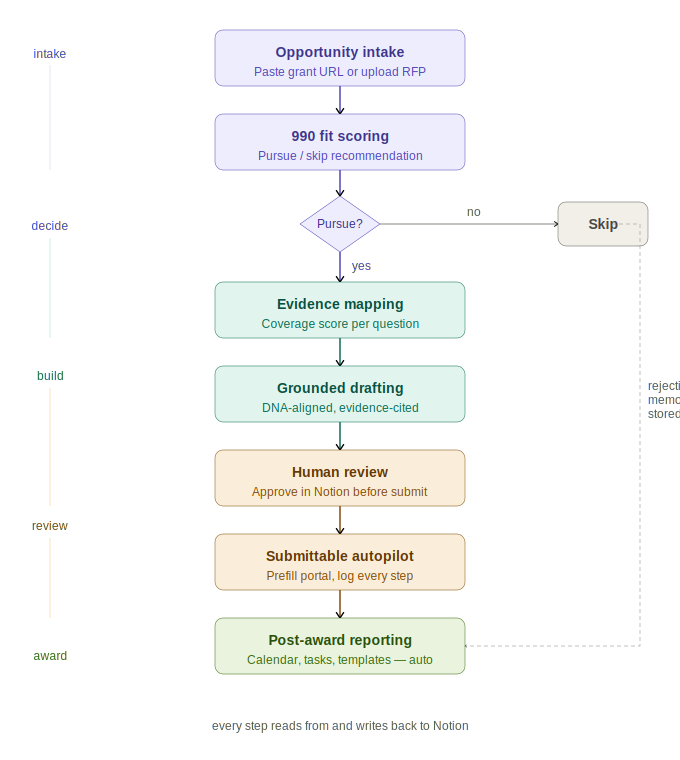
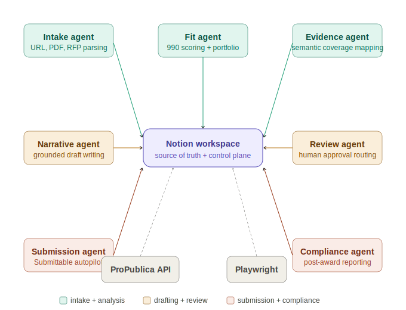
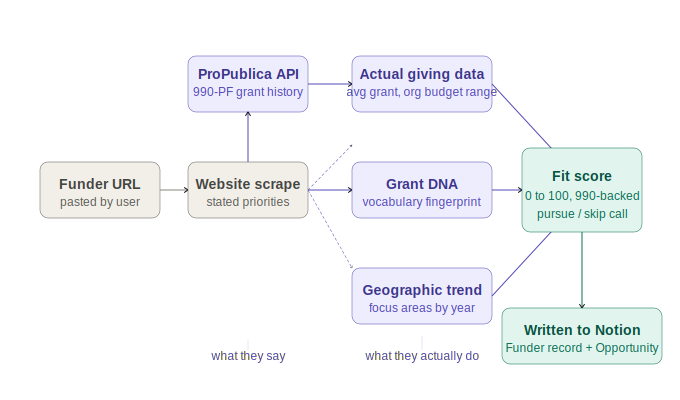
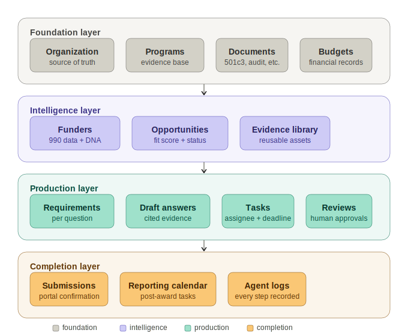

# Grant Guardian

<p align="center">
  
</p>

> **A Notion-native AI operating system for the full grant lifecycle, from pursuit decision to post-award compliance.**

Grant Guardian helps small nonprofits decide which grants are worth pursuing, map existing evidence to every application question, write in each funder's language, remember past losses, automate deterministic Submittable admin work, and stay compliant after award, all from one local workspace with Notion as the visible operating layer.

This repo contains the full working product:
- a Fastify orchestration backend
- a Next.js web app
- SQLite + Drizzle persistence
- Gemini-powered analysis and drafting
- ProPublica-powered funder research
- Notion OAuth + workspace sync
- Playwright-assisted submission handoff

---

## What Problem This Solves

Most small nonprofits do not lose grants because they lack mission. They lose because grant work is fragmented:

- funder research is shallow and often based on website copy instead of actual filing behavior
- evidence lives across PDFs, spreadsheets, past proposals, and staff memory
- the same organization details are re-entered into every new portal
- low-fit opportunities consume time that should have gone to better bets
- institutional knowledge disappears when staff turns over
- most grant tooling ends at submission and ignores reporting obligations

**Grant Guardian is not just a writing helper. It is a decision, memory, and operations system for lean grant teams.**

---

## What Grant Guardian Does

Paste a grant page, raw grant text, RFP link, PDF, or Submittable opportunity. Grant Guardian can:

1. Build a structured opportunity workspace in Notion
2. Pull real funder intelligence from IRS filings via ProPublica
3. Fall back from `990-PF` to `990` when private-foundation filings are unavailable
4. Score fit, evidence coverage, effort, and priority
5. Map every requirement to existing evidence, documents, or budget artifacts
6. Generate grounded drafts with evidence references and unsupported warnings
7. Compare draft language against the funder's "Grant DNA"
8. Queue review and approval workflows
9. Assist with Submittable org-field entry using guarded browser automation
10. Store rejection lessons as reusable institutional memory
11. Create reporting timelines, tasks, and templates after award

---

## Product Diagrams

### 1. Full Grant Lifecycle



### 2. Agent and Orchestrator Architecture



### 3. Funder Intelligence and Filing Pipeline



### 4. Notion Workspace Schema



---

## Flagship Capabilities

### IRS Filing Intelligence

Grant Guardian researches what a funder actually funds, not just what it says it funds.

It can:
- resolve a funder from name or website
- query ProPublica Nonprofit Explorer
- parse `990-PF` filings when available
- fall back to `990` filings when `990-PF` is absent
- compute grant-size patterns, geography concentration, issue-area concentration, repeat-grantee behavior, and small-org friendliness
- write the resulting funder summary back to Notion

### Grant DNA

Grant DNA builds a vocabulary fingerprint from:
- funder website language
- opportunity text and RFP language
- available filing purpose descriptions

It surfaces:
- top weighted phrases
- framing style labels
- tone summary
- draft alignment score
- concrete wording suggestions without inventing new facts

### Evidence Coverage Meter

Each requirement is scored as:
- `Green`: direct support exists
- `Amber`: partial support exists
- `Red`: no support exists

This helps a team quickly answer:
- Do we have enough evidence to apply?
- What is missing?
- What can be drafted honestly right now?

### Grounded Drafting

Draft generation is designed to be evidence-first:
- evidence refs are attached to each answer
- unsupported sections are explicitly marked
- DNA score and suggestions are shown next to each draft
- answers can be edited and approved inline
- synced drafts land in the Notion `Draft Answers` database

### Portfolio Optimization

Open opportunities are ranked with a transparent formula:

```text
Priority = (Fit x 0.40) + (Evidence Coverage x 0.30) + (Deadline Proximity x 0.20) - (Effort x 0.10)
```

The dashboard then classifies opportunities as:
- `Pursue Now`
- `Revisit Later`
- `Skip`

### Rejection Memory

When a team loses a grant, Grant Guardian stores:
- feedback text
- extracted themes
- next-cycle recommendations
- funder-specific warning signals for future opportunities

### Submission Handoff

Grant Guardian never auto-submits.

Instead, it:
- opens the confirmed portal
- autofills deterministic org-profile fields
- pauses at narrative sections
- pauses before final submit
- logs each action to the app and Notion

### Post-Award Reporting

When an opportunity is awarded, Grant Guardian can create:
- reporting calendar records
- milestone and data-collection tasks
- report templates seeded from proposal commitments
- a reporting sub-page in Notion

---

## Notion as the Control Plane

Notion is the visible operating system for the product. The user shares one page during OAuth, and Grant Guardian bootstraps the rest of the workspace under that page.

### Core Databases

| Database | Purpose |
|---|---|
| Organization | Org profile, mission, contact details, service areas |
| Programs | Programs, outcomes, leads, target populations |
| Funders | Funder records, filing intelligence, Grant DNA |
| Funder Filings | Parsed `990` / `990-PF` records by tax year |
| Opportunities | Active and historical opportunities |
| Requirements | One row per question, document request, or submission requirement |
| Evidence Library | Reusable outcomes, metrics, and evidence snippets |
| Documents | Uploaded organization documents and filing-source metadata |
| Budgets | Program and organizational budgets |
| Draft Answers | Grounded drafts with evidence refs, DNA score, and status |
| Tasks | Missing evidence tasks, review tasks, reporting tasks |
| Reviews / Approvals | Human review workflow |
| Submissions | Submission readiness and packet tracking |
| Reporting Calendar | Awarded-grant reporting obligations |
| Lessons / Rejections | Rejection memory and recommendations |
| Agent Logs | Audit trail of automated actions |

### Important Notion Constraints

- Notion OAuth is user-based and requires sharing at least one page
- Grant Guardian builds its own workspace structure under that shared page
- uploaded file binaries remain local; Notion stores synced metadata and references
- the product is designed to keep a human in the loop for sensitive actions

---

## How to Use Grant Guardian

### As a Brand-New User

1. Sign up in the web app
2. Connect Notion and share one page
3. Create your organization workspace
4. Add at least one program, some evidence, a budget, and key documents
5. Add an opportunity
6. Run analysis
7. Review fit, funder intelligence, evidence coverage, and Grant DNA
8. Generate drafts
9. Build review queue
10. Launch submission handoff when needed
11. Record lessons on rejected grants
12. Activate reporting on awarded grants

### Useful Guides

- [New User Guide](docs/new-user-guide.md)
- [Manual Website Test Guide](docs/manual-website-test-guide.md)
- [Local Launch Checklist](docs/local-launch-checklist.md)
- [Architecture Notes](docs/architecture.md)
- [Schema Notes](docs/schema.md)

---

## Local Setup

### Prerequisites

- Node.js 20+ recommended
- npm
- a Notion account
- a Gemini API key
- Clerk keys for authentication
- optional Submittable credentials for browser-handoff testing

### 1. Clone and install

```bash
git clone https://github.com/DipeshK47/GRANT_GUARDIAN.git
cd GRANT_GUARDIAN
npm install
```

### 2. Configure environment

```bash
cp .env.example .env
```

Fill in the important values:

```env
GEMINI_API_KEY=your_key_here

NEXT_PUBLIC_CLERK_PUBLISHABLE_KEY=your_clerk_publishable_key
CLERK_SECRET_KEY=your_clerk_secret_key

NOTION_OAUTH_CLIENT_ID=your_notion_client_id
NOTION_OAUTH_CLIENT_SECRET=your_notion_client_secret
NOTION_OAUTH_REDIRECT_URI=http://localhost:4000/auth/notion/callback
NOTION_MCP_SERVER_URL=https://mcp.notion.com/mcp
```

### 3. Start the full local app

```bash
npm run dev
```

This starts:
- the Fastify orchestrator
- the Next.js web app

Then open:

```text
http://localhost:3000
```

### 4. Database notes

The backend now auto-runs bundled Drizzle migrations on startup for fresh SQLite databases.

You can still run migrations manually if needed:

```bash
npm run db:migrate
```

### 5. Optional demo helpers

```bash
npm run seed:demo
npm run submittable:install-browser
npm run submittable:save-session
```

---

## Website-First Usage Flow

If you want to evaluate the product the way a real nonprofit user would:

1. Start the app with `npm run dev`
2. Open the homepage
3. Click `Get started free`
4. Connect Notion
5. Create the organization
6. Add one opportunity
7. Go to the workspace
8. Add:
   - at least one program
   - at least two evidence items
   - one structured budget
   - core documents such as a 501(c)(3), budget, and board list
9. Re-run analysis
10. Generate drafts
11. Review Notion sync

The sample test dataset and exact walkthrough live here:

- [Manual Website Test Guide](docs/manual-website-test-guide.md)

---

## Helpful Commands

### App

```bash
npm run dev
npm run dev:web
npm run dev:orchestrator
```

### Quality checks

```bash
npm run build
npm run typecheck
```

### Notion and workspace

```bash
npm run bootstrap:notion
npm run onboarding:status
npm run organization:save
```

### Opportunity pipeline

```bash
npm run run:opportunity -- --url "https://example.org/grant"
npm run enrich:funder -- --funder-id=FUND_ID
npm run parse:funder-filings -- --funder-id=FUND_ID --force
npm run analyze:opportunity -- --opportunity-id=OPPORTUNITY_ID
npm run draft:opportunity -- --opportunity-id=OPPORTUNITY_ID
npm run review:opportunity -- --opportunity-id=OPPORTUNITY_ID
```

### Submission and reporting

```bash
npm run assemble:submission -- --opportunity-id=OPPORTUNITY_ID
npm run prepare:form-fill -- --opportunity-id=OPPORTUNITY_ID
npm run launch:submission-autopilot -- --opportunity-id=OPPORTUNITY_ID
npm run activate:reporting -- --opportunity-id=OPPORTUNITY_ID
```

---

## Repository Structure

```text
grant_guardian/
├── apps/
│   ├── orchestrator/        # Fastify backend and grant workflow services
│   └── web/                 # Next.js frontend
├── packages/
│   └── shared/              # Shared types and package-level utilities
├── docs/                    # Architecture, guides, launch notes
├── images/                  # Submission diagrams and SVG assets
├── data/
│   ├── demo/                # Demo and manual test kit files
│   ├── snapshots/           # Cached funder snapshots and filing artifacts
│   └── uploads/             # Local uploaded documents
├── scripts/                 # Operational scripts for the full workflow
└── tests/                   # Test assets and automation support
```

---

## Tech Stack

| Layer | Technology |
|---|---|
| Language | TypeScript |
| Frontend | Next.js App Router |
| Backend | Fastify |
| Database | SQLite + Drizzle ORM |
| Auth | Clerk |
| AI / NLP | Gemini |
| Funder Data | ProPublica Nonprofit Explorer |
| Browser Automation | Playwright |
| Workspace Layer | Notion OAuth + Notion-native workspace sync |

---

## Guardrails

- No invented facts in proposals
- Unsupported claims are explicitly marked
- Human approval stays in the loop for sensitive actions
- Final submission is never fully automated
- Portal credentials are not stored in Notion
- Document binaries stay local; Notion stores synced metadata and operating context

---

## Known Limitations

- hosted free-tier deployments are demo-grade, not production-grade
- filing quality varies by organization and tax year
- `990-PF` data is richer for grantmaker behavior than `990`, though the system now falls back when needed
- browser automation is strongest for deterministic org-profile fields, not narrative completion
- Notion file uploads are metadata-oriented rather than true document storage

---

## Roadmap

- more portal support beyond Submittable
- deeper funder relationship tracking
- stronger multi-user and role-based workflows
- more polished hosted deployment path
- broader grant-source coverage beyond current v1 focus

See also:
- [Roadmap](docs/roadmap.md)

---

## Acknowledgments

- [ProPublica Nonprofit Explorer](https://projects.propublica.org/nonprofits/)
- [Notion](https://developers.notion.com/)
- [Gemini](https://ai.google.dev/)
- every small nonprofit development team doing high-stakes work with too little operational support

---

*Built for the Notion MCP Challenge and shaped around the realities of small nonprofit grant teams.*
